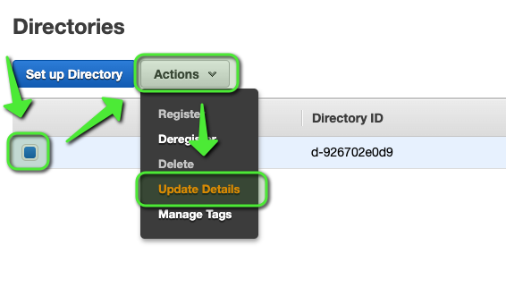
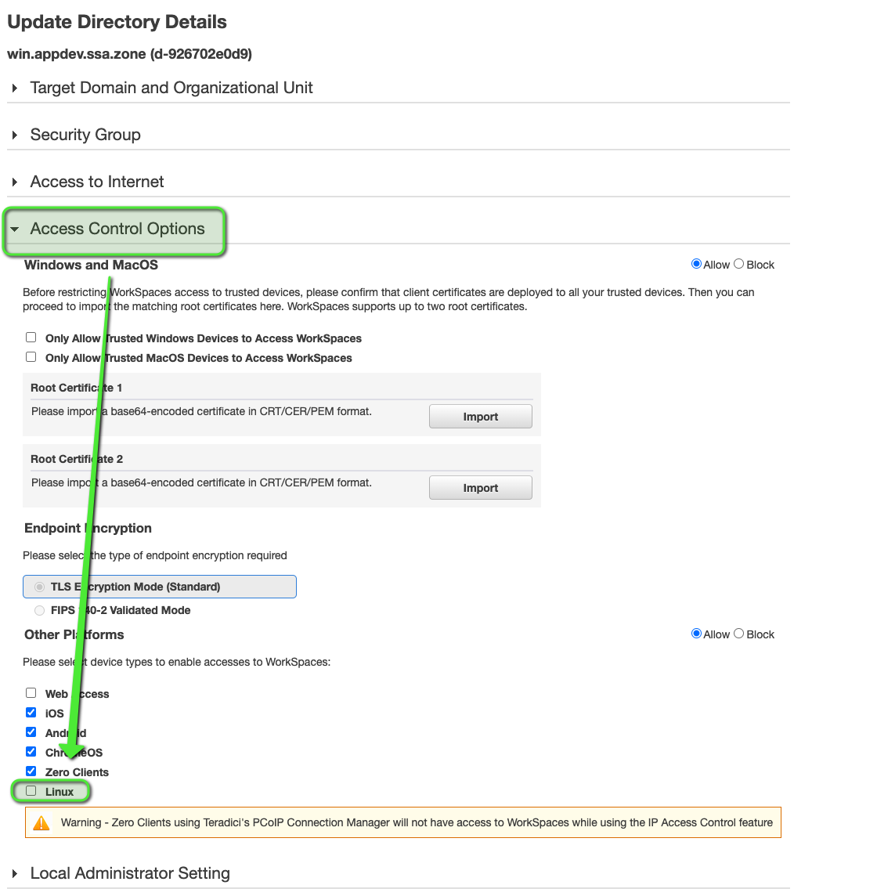
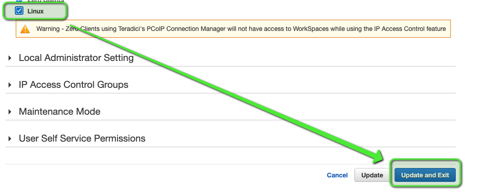

# workspace_simplead

**Note:** Sometimes the AWS Workspace directory does not use the same subnets as `SimpleAD`, see [reddit for more](https://www.reddit.com/r/aws/comments/esw6fd/workspace_provisioning_in_wrong_subnet/)

## Overview

This will create an AWS Directory Service of type `SimpleAD` and a Workspace directory where you can add workspaces to

## Steps

1. Create the `workspaces_DefaultRole` role

See [here](../workspaces_DefaultRole/)

2. terragrunt apply in this folder

```shell
$ terragrunt apply
```

## Enable Access from Linux Clients

1. Go to AWS console -> Workspaces -> Directories -> Actions -> Update Details



2. Click on `Access Control Options` -> Check the box for `Linux`



3. Click `Update and Exit`



<!-- BEGINNING OF PRE-COMMIT-TERRAFORM DOCS HOOK -->
## Providers

| Name | Version |
|------|---------|
| aws | 2.67.0 |

## Inputs

| Name | Description | Type | Default | Required |
|------|-------------|------|---------|:-----:|
| change\_compute\_type | Whether WorkSpaces directory users can change the compute type (bundle) for their workspace | `bool` | `false` | no |
| environment | See [Sysenvs shortname](https://github.com/nxtlytics/ivy-documentation/blob/master/howto/Architecture/Specifications_and_Definitions/System_Environments_SysEnvs.md#short-name-aka-dcvpc-name) | `string` | n/a | yes |
| increase\_volume\_size | Whether WorkSpaces directory users can increase the volume size of the drives on their workspace | `bool` | `false` | no |
| name | The fully qualified name for the directory, such as `corp.example.com` | `string` | n/a | yes |
| namespace | Prefix to use with all tag keys | `string` | n/a | yes |
| profile | ~/.aws/credentials profile to use with the terraform aws provider not the s3 backend | `string` | n/a | yes |
| rebuild\_workspace | Whether WorkSpaces directory users can rebuild the operating system of a workspace to its original state | `bool` | `false` | no |
| region | AWS Region to use | `string` | n/a | yes |
| restart\_workspace | Whether WorkSpaces directory users can restart their workspace | `bool` | `true` | no |
| size | The size of the directory (`Small` or `Large` are accepted values) | `string` | n/a | yes |
| ssm\_parameter | The name of the parameter with the directory password | `string` | n/a | yes |
| switch\_running\_mode | Whether WorkSpaces directory users can switch the running mode of their workspace | `bool` | `false` | no |
| sysenv | See [System Environments (SysEnvs)](https://github.com/nxtlytics/ivy-documentation/blob/master/howto/Architecture/Specifications_and_Definitions/System_Environments_SysEnvs.md) | `string` | n/a | yes |
| tags | A mapping of tags to assign to the resources in this module. | `map` | `{}` | no |
| team\_email | E-Mail for the team managing these resources | `string` | n/a | yes |

## Outputs

| Name | Description |
|------|-------------|
| aws\_directory\_service\_directory-this-access\_url | The access URL for the directory, such as `http://alias.awsapps.com` |
| aws\_directory\_service\_directory-this-dns\_ip\_addresses | A list of IP addresses of the DNS servers for the directory or connector |
| aws\_directory\_service\_directory-this-id | The directory identifier |
| aws\_directory\_service\_directory-this-name | The fully qualified name for the directory, such as `corp.example.com` |
| aws\_directory\_service\_directory-this-password | The directory identifier |
| aws\_directory\_service\_directory-this-security\_group\_id | The ID of the security group created by the directory |
| aws\_directory\_service\_directory-this-username | The directory identifier |
| aws\_workspaces\_directory-this-id | The WorkSpaces directory identifier |

<!-- END OF PRE-COMMIT-TERRAFORM DOCS HOOK -->
